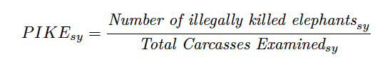

     

# MIKE-GLMM 2022 (unweighted model)
PIKE TREND ANALYSIS USING A BAYESIAN GENERALISED LINEAR MIXED MODEL APPROACH IN R

CITES MIKE Programme
June  2022

This repository contains R script used to analyse data from the Monitoring the Illegal Killing of Elephants (MIKE) Programme to produce outputs for reports to the
relevant meetings of the Convention for International Trade in Endangered Species of Wild Fauna and Flora (CITES). The MIKE Programme is a site-based system designed to monitor trends in the illegal killing of elephants, build management capacity and provide information to help range States make appropriate management and enforcement decisions. MIKE evaluates relative poaching levels based on the Proportion of Illegally Killed Elephants (PIKE), which is calculated as the number of illegally killed elephants found divided by the total number of elephant carcasses encountered, aggregated by site and across year.

The analytical approach documented <a href="https://github.com/CITESmike2020/MIKE-GLMM">here</a> has been recommended by the MIKE-ETIS Technical Advisory Group (TAG) after the review of the MIKE analytical methodology initiated by the CITES Secretariat in collaboration with the MIKE-ETIS TAG. Various methodologies / models were considered and the use of a Bayesian generalised linear mixed model (GLMM) approach, with model results unweighted by local elephant population estimates were recommended by the TAG in <a href="https://cites.org/sites/default/files/MIKE/E-Technical_Report_Africa_summary.pdf"> 2020</a> to replace the previous modelling approach that had been used in prior reports considered by the meetings of the Conference of Parties to CITES and CITES Standing Committee. 

The Bayesian unweighted GLMM  approach was used to report PIKE trends in the MIKE report: <a href="https://cites.org/sites/default/files/MIKE/E-PIKE_Trend_Analysis_Aug2021.pdf"> Monitoring the Illegal Killing of Elephants (MIKE) PIKE trend analysis 2003-2020</a>, released by the CITES Secretariat in November 2021. <a href="https://github.com/CITESmike2020/GLMM-2021-unweighted-model"> The code used in the analysis is located here. </a>  A list of GitHub repositories for previous analysis can be found <a href= "https://cites.org/eng/prog/mike/index.php/portal#MIKE%20Analytical%20Code"> here </a>.

The Bayesian GLMM (unweighted)  approach is used to report PIKE trends in the MIKE report: <i>Monitoring the Illegal Killing of Elephants (MIKE) PIKE trend analysis 2003-2021</i>, released by the CITES Secretariat in July 2022.  <a href="https://cites.org/sites/default/files/documents/COP/19/agenda/E-CoP19-66-05.pdf"> Click here to see the report.</a> 

The code to generate the MIKE report is included in this GitHub repository. 

# MIKE - GLMM  (unweighted) Model for PIKE

This GitHub sites contains code and reports to estimate yearly-trends in the Proportion of Illegally Killed Elephants (PIKE) based on data collected at
MIKE (Monitoring Illegally Killed Elephants) monitoring sites in Africa and Asia since 2003.

Briefly, MIKE data is collected on an annual basis in designated MIKE sites by law enforcement and ranger patrols in the field and through other means. When an elephant carcass is found, site personnel try to establish the cause of death and other details, such as sex and age of the animal, status of ivory, and stage of decomposition of the carcass. This information is recorded in standardized carcass forms, details of which are then submitted to the MIKE Programme. As expected, different sites report widely different numbers of carcasses, as encountered carcass numbers are a function of: population abundance; natural mortality rates; the detection probabilities of elephant carcasses in different habitats; differential carcass decay rates; levels of illegal killing; and levels of search effort and site coverage. 

The observed proportion of illegally killed elephants (PIKE) as an index of poaching levels has been used in the MIKE analysis in an attempt to account for differences in patrol effort between sites and over time:

  

where the subscripts *sy*  refer to site and year respectively. PIKE is an index of poaching pressure and provides trends relating to the levels of poaching. It may be affected by several potential biases related to data quality, reporting rate, carcass detection probabilities, variation in natural mortality rates and other factors, and hence results need to be interpreted with caution.

This GitHub repository contains code and reports on using a Generalized Linear Mixed Model (GLMM-unweighted) to estimate yearly-trends in PIKE.

# Structure of this repository
You will have to insert your google key in the *register_google_key.R* file so that
the programs can download maps of Africa and Asia.   See ?register_google after loading the ggmap package.

There are several directories in this repository

- Code. This contains the .Rmd files and associated functions for fitting and analysing the MIKE data.
The key documents are the 
  * Africa.technical.update-2022.Rmd
  * Asia.technical.update-2022.Rmd
files.   
These load the 
  * *fitting-functions-R* files that contain functions for the analysis
  * *read.xxx.R* files that read in and pre-process the data for Africa and Asia
- Data. This contains the data used in the MIKE analysis.
- ReportsAndEstimates. This contains the reports generated by the Asia/Africa technical documents in html, PIKE estimates in csv and slope analysis reports using the posterior samples in html. 

# Updating with a new year of data

The following steps should be followed to update the estimates when a new set of data is
available. The steps for the Africa reports are given below; the steps for Asia are similar

- Update the files in the *Data* directory.
- Update the *read.africa.R* file in the *Code* directory to point to the new file names.
- Open and knit the *Africa.technical.update-2022.Rmd* documents to create the html/pdf documents.
This will take two runs, one for the *html* file and one for the *pdf* file.
- Put the date of creation in the front of the created html/pdf files and move to the *ReportAndEstimates* directory.
- Put the date of creation in the front of the created *report.africa.estimates.csv* file and
move to the *ReportAndEstimates* directory.
- Put the date of creation in the front of the created *.Rdata* files which saves the 
posterior samples from the continental or subregional fits. You likely will NOT want to manage these files with GitHub because of their size.
-	To generate a slope analysis report, based on the posterior samples, open and knit the *Slope_Analysis.Rmd* document to create the html/pdf documents.

# Change Log

#### *2022-05-25*

*README.md* file updated to include additional introductory text, and hyperlink to the MIKE report.

The slope analysis code has been expanded to include all the trend analysis reported in the MIKE report.
#        

